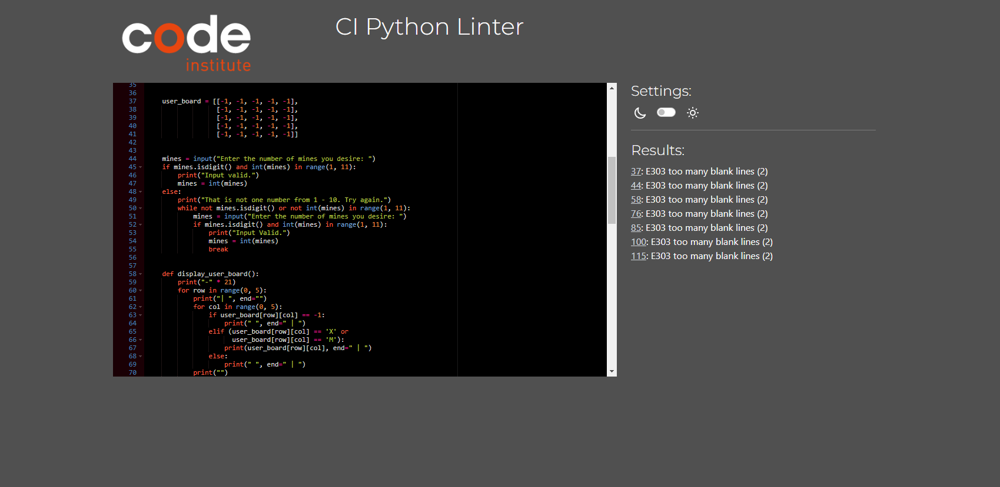

## Testing

This python terminal project was tested using The Code Institutes Python Linter. The results of which are below: 

As you can see, the linter returned the error E303 on multiple occassions. This is because I decided to code all functions within the main. In order  to fix these E303 errors I un-indented lines 37, 44, 58, 76, 85, 100 and 115. This however severley broke my code and, given the time constraints of a deadline, I decided that as my program runs uninterputed with the errors, they would stay. 

In future variations of the project, these E303 errors will be dealt with. However, as they do not disrupt the flow and functionality of the program itself, it is not deemed as a 'significant issue'.